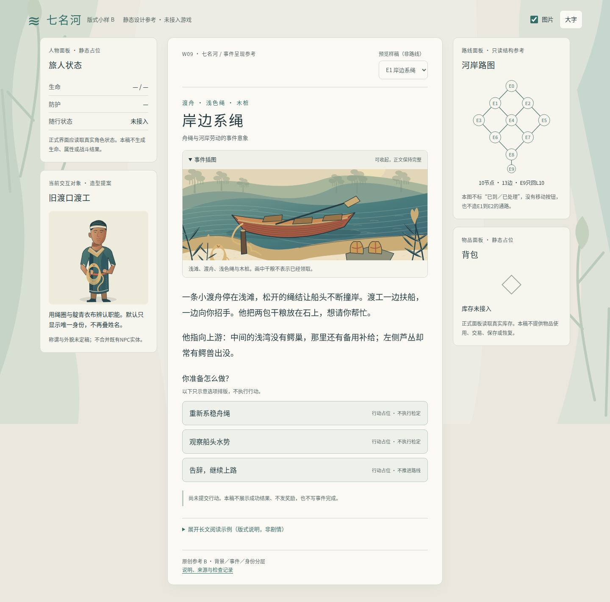
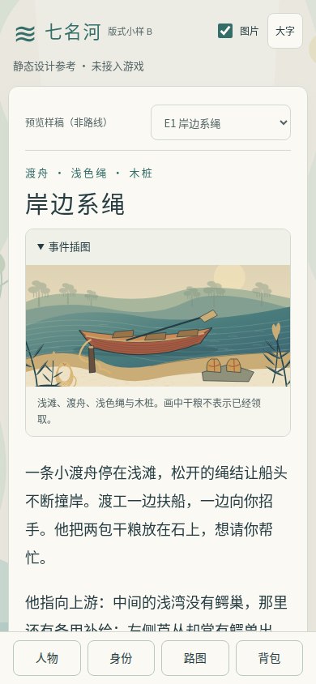

# 七名河：竖向素底与双端归一化样稿 B

References [sagitrs/sgstory-books#473](https://github.com/sagitrs/sgstory-books/issues/473)。这是独立静态设计样稿，不是游戏更新。作者视觉自审认为值得提交 Draft PR 讨论；这不等于操作者认可效果、实现验收或发布许可。原设计 [PR #475](https://github.com/sagitrs/sgstory-books/pull/475) 不在本轮修改范围。

## 为什么试做

操作者先建议竖图素底背景、网页左右面板与手机弹窗，并把信息量较高的旧图用于事件开头；随后授权：“可以，试做一下，效果好的话提PR。”原话及本轮范围已[公开转录](https://github.com/sagitrs/sgstory-books/issues/473#issuecomment-6036610907)，没有可提供的原对话公开链接。

本稿把这几个用途分开：

- **背景板**：1200×2000原创竖图。芦苇、岸形、水色在边缘，中间素底；不画事件结果、可点击出口或进度。桌面、窄屏各自裁切，但正文始终有不透明底色，不靠图片的空白区保证可读。
- **事件图与名称**：复用E1、E2的图，在事件开头进入文字流。默认展开，可主动收起；不强制弹窗、不做转场或自动播放。标题和正文不依赖图中文字。
- **身份肖像**：复用两份候选造型。用于辨认职能，不叠姓名、不新增NPC实体。称谓及外貌还需核真实映射与消歧。

已有资产计入预算：本稿使用1张背景板、2张事件图、2张身份肖像，仍是3＋2。没有加入E6图而变成4＋2，也没有叠加历史资产作上线数量承诺。PNG背景是同一SVG的导出件，不是另一张原图。

## 打开与看图

下载目录后可直接打开 [index.html](index.html)。更可靠的本地预览方式：在本目录运行 `python3 -m http.server 41873 --bind 127.0.0.1`，浏览器打开 `http://127.0.0.1:41873/`。服务器只提供本目录的静态文件；端口占用时换一个空闲端口。GitHub文件页面不执行HTML样稿，也没有把它发布到线上游戏或Pages。

| 预览 | 文件 |
| --- | --- |
| 桌面中央阅读与左右UI | [桌面截图](evidence/desktop.png) |
| 窄屏阅读与底部入口 | [390px截图](evidence/mobile.png) |
| 同一身份面板进入弹窗 | [窄屏弹窗截图](evidence/mobile-identity.png) |
| 竖向背景原图 | [可编辑SVG](assets/river-backdrop.svg) / [PNG](assets/river-backdrop.png) |

截图是样稿在本地Chromium中的实际画面。窄屏只是桌面浏览器视口，非真手机；截图不是游戏运行、存档或战斗证据。

## 两端共用什么

网页宽屏中央为稳定阅读区；左侧是人物与当前身份，右侧是路图与背包。1040px及以下不硬挤两侧，而通过底部四个入口打开原生 `dialog`。

两端使用同一个面板DOM，而不是复制第二份内容或另记第二套状态。关闭时移回侧栏占位；若打开中变为桌面，自动关闭并归位，焦点回到正文。普通关闭或Escape回到原触发入口，不改变正文滚动位置。弹窗中Tab、Shift+Tab留在弹窗内。

“共用”在这里只证明样稿的内容与面板容器可以共用，不证明真实游戏已完成接线。人物和背包明确标“未接入”，不造生命、属性、库存、装备或保存状态。静态路图沿10节点、13边，只说明结构，不标已到、已处理、胜负；E9只回L10。E1/E2下拉框是查看独立样稿，不是路线导航，更不是新增E1→E2出口。

动作列表只示意排版，不能点击执行。尚未提交行动的提示不把画中的干粮、绷带或水图变成已经领取或成功处理。

## 阅读与回退

- 正文使用素底深色字，没有纸纹、水纹或芦叶穿过字行。字号可切大字；长文说明独立折叠，不混入剧情。
- 图片开关同时关闭装饰背景、事件图与肖像，保留标题、身份、图注、正文和选项文字。开关、大字、折叠、样稿选择仅为当前页面呈现偏好，不写存储。
- 图片失败时保留固定占位与替代提示；字体失败时使用系统回退。样稿没有等待图片后才开放正文或面板入口的逻辑。
- 不启用JavaScript时显示E1、正文、原生插图折叠以及四个直接展开的面板；不显示失效的设置、切换或弹窗入口。
- 没有向游戏变量、存档、随机数、剧情API、检定、战斗、领奖、物品使用、移动或返程接口写入。样稿不导入游戏或引擎脚本，没有外部网络依赖。

正式实施仍应复用#311及PR #373已有视觉能力，不把样稿的CSS、字体加载和面板搬移直接当第二套生产宿主。#467地图、过滤、快存修复仍属原线。本轮不改pin、版本或0.0.3范围，不建立新的发布前置条件。

## 来源、许可与维护

- E1/E2的事实及选项来自[冻结基座的事件设计](https://github.com/sagitrs/sgstory-books/blob/9d3732b5317af4606b3ce2fe0bbdd92a5b84efdc/docs/plans/babel/optional/tutorial-seven-names/events.json)及[README](https://github.com/sagitrs/sgstory-books/blob/9d3732b5317af4606b3ce2fe0bbdd92a5b84efdc/docs/plans/babel/optional/tutorial-seven-names/README.md)。`events.json`是内容设计目录，不是运行schema；冲突仍沿README的公开裁定链处理。本稿不改路线、检定、奖励或唯一领奖事实。
- 背景板为本轮直接编写的原创SVG；两张事件图、两张肖像来自本席2026-10-07的原创参考A稿。没有使用外部图像模型、真人照片、竞品素材、商标或外部拼贴。不冒充具体文物、古服、种族或宗教考据。
- 正文字体是官方[Noto CJK](https://github.com/notofonts/noto-cjk)的Noto Sans CJK SC Regular字形子集，改名为 **River Study Sans**，保留原版权及许可记录。详见[OFL 1.1](assets/FONT-LICENSE.txt)、[字体版权与修改说明](assets/FONT-NOTICE.txt)和[素材清单及SHA256](asset-manifest.json)。未安装系统字体。子集只含本稿字形；改文案时应重新生成子集或使用宿主字体，不能误以为覆盖全部中文。
- 可直接编辑五份SVG；背景PNG用既有CairoSVG从对应SVG导出。HTML/CSS/JS均是本稿源文件，不需要构建器或包管理器。
- 字体许可及原创来源不等于整套产品商用尽调完成。正式采用前仍由仓所有者核素材登记、作者/来源/许可、修改与使用范围、真实NPC映射、尺寸体积以及宿主回退。

## 作者自审与尚未验证

[检查记录](review-notes.md)区分已观察、修正历史与未覆盖；[原始摘要](evidence/observations.json)记录视口、正文宽度、弹窗、焦点与面板唯一性，[源文件指纹](evidence/source-fingerprints.json)绑定实际检查内容。

目测这版比把事件图直接铺在文字背后更适合持续阅读；边缘背景不抢正文，桌面两侧与窄屏弹窗的职责清楚。这只是作者判断，不是玩家留存或操作者验收。首屏事件图仍占高度，提供收起及关图；下一步应让用户判断默认展开是否合适，而不是根据作者目测固定产品默认值。

真实手机、Safari/Firefox、屏幕阅读器、实际慢网、长期长文阅读舒适度、性能预算、正式游戏集成与保存恢复均未验。需求#473保持open、working；本稿及PR不关闭需求，不代勾产品验收。
