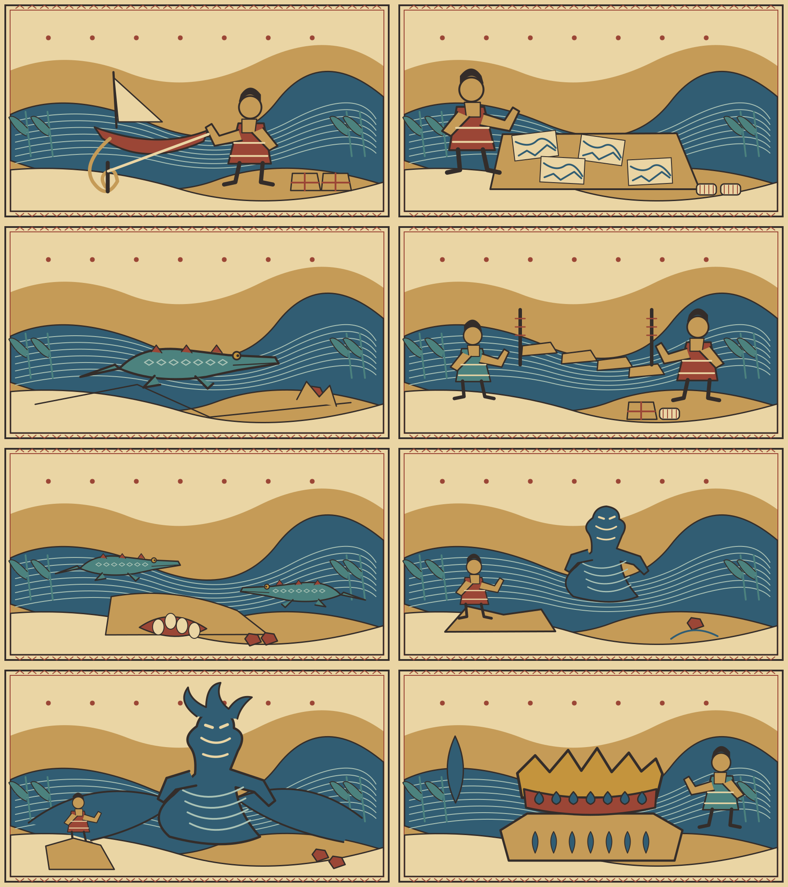
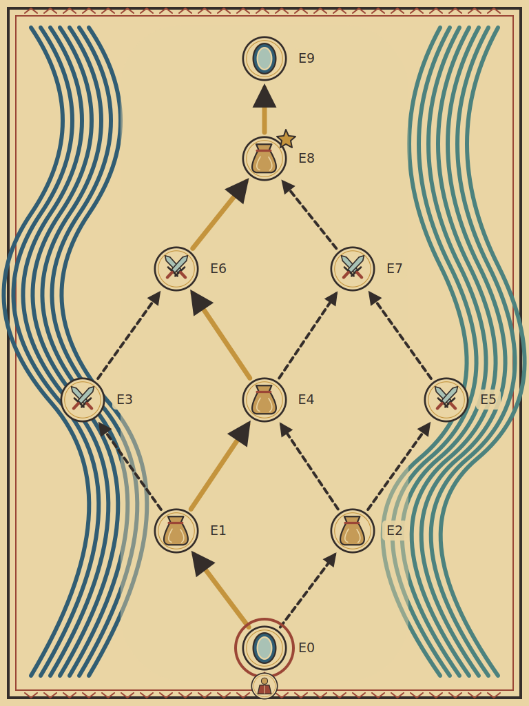
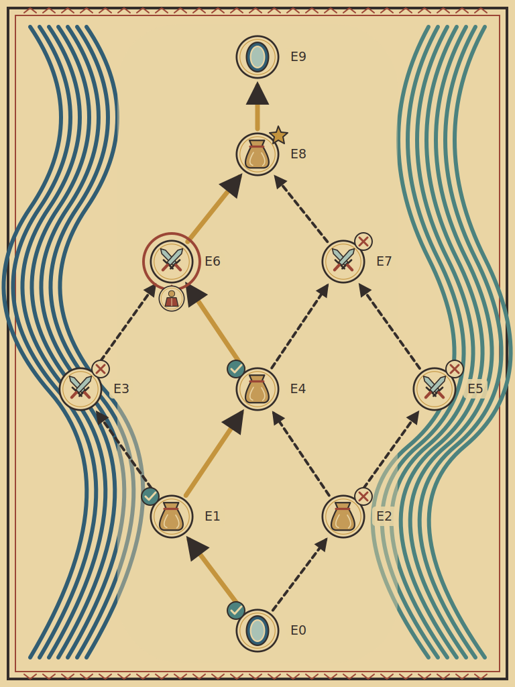

# 七名河：首次出城固定教程设计

状态：**待评审设计，尚未接入游戏。** 本PR只提交文档、固定内容目录和原创审阅插图，不改故事源码、引擎pin、测试工具、CI或存档。

需求：[sgstory-books #393](https://github.com/sagitrs/sgstory-books/issues/393)；引擎配对需求：[sgstory #2021](https://github.com/sagitrs/sgstory/issues/2021)。通用能力见[引擎设计](https://github.com/sagitrs/sgstory/blob/docs/2021-seven-names-engine/docs/plans/seven-names-engine-support.md)。跨仓链接指向配对设计分支，若合入后删除分支，须改为合入提交链接。

## 1. 范围、依据与状态

本方案接在既有[L10城内循环](../cities/L10-first-city.md)之后：正常抵达L10，第一次出城进入L11固定教程，处理事件、真实检定与战斗、拾取和地图，从E9或提前传送返L10，执行脆弱结算，随后继续正常城镇活动。它依附[生命与选择](../../core/02-life-body-and-choice.md)、[城市与冒险](../../core/03-cities-and-adventure.md)，不重做居民证、城内服务或固定L19。

作者明确要求固定首次教程、引导少战斗主干、城镇带入装备也会脆弱、正常死亡、移除提前回城道具并采用每层一次传送、E9只回城及下文指定提示原句。设计时从20世界提纲等概率抽选一次，结果为**W09 · River of Seven Names／七名河**；此后本教程不再抽世界、事件、敌人或结果掉落。W09是世界编号，不是地图L19。

作者最新允许放弃头脑风暴条件的同时成立。现在采用**真实成败、不强制避战失败、不设结果最高14的封顶**。当前逃脱－6、应战侦察＋3及各DC作为可实测调整的候选；不能把先前“必败”要求恢复为验收目标。

具体事件和奖励、重访恢复、脆弱适用集合／稳定豁免、传送消费、完成后去向及铜冠效果是助手补足的候选，不冒充作者已逐项批准或游戏已有功能。20世界运行化、普通地图生成、英雄任务、时代Boss均不在首版闭环；后续地图“先低难主干、再高难分支”是设计原则，不是本PR提供的生成器。

## 2. 固定拓扑与主干

地图自下而上、单向，E0入口、E9出口。共10节点、13条边、6条完整路线，每路经过4个事件，含E8。

```text
E0 → E1 / E2
E1 → E3 / E4
E2 → E4 / E5
E3 → E6
E4 → E6 / E7
E5 → E7
E6 / E7 → E8 → E9
```

推荐主干：`E0→E1→E4→E6→E8→E9`，3奖励、1战斗类遭遇。E0推荐左岸、E1推荐右侧浅湾、E4推荐左侧小型水灵，说明原因但不替玩家选。经过E4的四条路线均为1战斗类／3奖励，其他两条为2／2；主干是低战斗数量路径之一，**不是已经验证的最低实际难度或必打战斗**。

| 节点 | 标题与类型 | 固定内容及下一步 |
|---|---|---|
| E0 | 陌生河岸，入口 | 说明效果、正常死亡和回城脆弱；左E1、右E2 |
| E1 | 岸边系绳，奖励 | 系绳DEX／DC8成功干粮2，观察WIS／DC8成功干粮1；失败或告辞0；左E3、右E4 |
| E2 | 失落水图，奖励 | 拼图INT／DC12成功绷带2，辨路WIS／DC12成功绷带1；失败或不接0；左E4、右E5 |
| E3 | 浅滩鳄影，战斗 | Crocodile×1；胜利铜矿1；到E6 |
| E4 | 借道浅湾，奖励 | 接下补给干粮1＋绷带1；请教WIS／DC8无论成败仍给同份补给；谢绝0；左E6、右E7 |
| E5 | 双鳄护巢，战斗 | Crocodile×2；胜利铜矿2；到E7 |
| E6 | 逆流水灵，战斗 | Small Water Elemental×1；胜利铜矿1；到E8 |
| E7 | 分流怒潮，战斗 | Medium Water Elemental×1；胜利铜矿2；到E8 |
| E8 | 听雨之冠，稀有奖励 | 同一Rain Diadem×1：佩戴／收袋／谢绝；到E9 |
| E9 | 归城门，出口 | 预览后确认回L10；不开放下一层 |

每个事件只选一个行动，结算后另显示方向、事件类型和风险。失败也保留基本路线情报；E2可转回E4，不因选择支路追加隐蔽惩罚。所有完整路线都到E8，不要求补打支路，也不保证各路收益相等。

## 3. 固定文本与插图附录

[events.json](events.json)收录E0／E9导入、E1–E8全文、每个选项的成败文本与奖励、敌人候选、导航和位置。它是**设计内容目录，不是运行时schema**；`tutorial.rain-diadem`等是候选内容id，仍须映射真实注册项，`equip_if_possible`等也不证明有相应API。



8张事件图各896×504；标题≤7字，导入≤300字／3段，事件行动≤4项。本稿8个事件均4字标题、2段导入、2–3行动；不要把行动和导航混成最多6个按钮。固定干粮、绷带及矿块的数量是领取内容，不直接等同charges。

素材为原创土黄、红赭、靛蓝平面装饰画，以七道水纹、舟绳、木桩、芦叶和测水石统一。七名河混合古印度早期沿河聚落和雨河秩序意象，不声称是统一史实、具体出土画复原或任何真实文化的终结。各共同体掌握部分真实水情，不以“唯一正确河名”裁定优劣。

`assets/events`保存八图的SVG／PNG；`assets/icons`为圆框双剑、袋子、问号、人形及双环传送门；`assets/maps`保存背景、拓扑、事件图标、两份玩家层及合成图。随机图标供未来共用，**本教程无随机事件**。这些是审阅资源，不由游戏构建读取；不把私人HTML或测试工具搬成游戏系统。

## 4. 检定、战斗与固定交付

事件采用本作自制裸属性检定：`d20＋属性修正＋本次修正 ≥ DC`。不加技能等级，不冒充Escape Artist、Swim等原生技能。自然1／20不自动成败；属性修正＋2、掷20、逃脱－6得16，对DC15就是成功。不得暗改骰子或成功结果。

“高歌猛进”进入教程获得，正常或提前回城移除，读档不叠加。－6只作用逃脱检定，不降低属性本身或系绳奖励工作；＋3只作用应战侦察，不加攻击、伤害、AC、豁免或奖励检定。

战斗节点的战前选择只能做一次：

- 应战侦察：WIS／DC10／＋3。成功确认固定数量、相对风险及适用环境；失败只少情报，不增怪、不换敌人。随后进入真实战斗。
- 属性脱离：E3／E6用DEX，E5／E7用STR，DC15／－6。成功通过，无散货奖励，不记胜利／击杀；失败立即开战，不重新选择侦察或另一种避战抵消失败。

进入战斗后沿现有D&D 3.5攻击、防御、技能、豁免、熟练和死亡规则。不采用5e优势或熟练加值。四组候选的**每只**参考CR为2／2／1／3，不是整场遭遇等级，更不是地图层号等于角色等级。须核真实能力和正常入场战力；Crocodile的Improved Grab、水元素的Water Mastery等不能只挑有利部分保留。引擎若缺能力，补实现或公开调整规格，不以怪物名称冒充完整SRD模板。

E6允许玩家留在干地，依Water Mastery实际处理，不强制下深水体验Vortex；E7图中浪花不自动判角色浸水。铜矿来自居民已允许打捞的旧运矿船散货；水元素原生`Treasure=None`不改成通用产矿。

来源为SRD3.5固定整理版本`c7f30a0ce11a579f75456746f278a4c75f67b4c1`：

- [monsters-animals.md: Crocodile](https://github.com/olimot/srd-v3.5-md/blob/c7f30a0ce11a579f75456746f278a4c75f67b4c1/monsters/monsters-animals.md)。
- [monsters-e-f.md: Water Elemental](https://github.com/olimot/srd-v3.5-md/blob/c7f30a0ce11a579f75456746f278a4c75f67b4c1/monsters/monsters-e-f.md)。
- [basics-and-ability-scores.md: Ability Modifiers](https://github.com/olimot/srd-v3.5-md/blob/c7f30a0ce11a579f75456746f278a4c75f67b4c1/basic-rules-and-legal/basics-and-ability-scores.md)。

规则引用不表示本作自制事件、侦察抽象或奖励来自SRD。资料遵循[原法律声明](https://github.com/olimot/srd-v3.5-md/blob/c7f30a0ce11a579f75456746f278a4c75f67b4c1/basic-rules-and-legal/legal-information.md)，与本作原创文本／图像分账；本PR不复制完整规则数值块。

固定掉落只走一个交付口，不再掷随机数量／品质；避战不调用旧胜利结算。容量不足时暂停领取或处理携带物，失败不先写已领取；实际投递与记录一同成立，双击不重复发奖。普通奖励失败无隐藏战斗、债役或直接致死，E4补给不以检定为必要门槛。

## 5. Rain Diadem候选

E8三选一，领取同一件或自愿谢绝，不能生成三种奖励。候选为头槽、无独立AC；佩戴并辨认七名河**已能听见**的呼水节拍时，Listen＋2环境加值，同源不叠，不翻译／读心／控水。该效果是助手自制，不是SRD原生铜冠。稀有不等于D&D Epic，不意味着稳定或免脆弱。

真实id、头槽接法、情境Listen加值能力和价格／是否可售须实现前确认。选择佩戴应沿现有装备流程；已占槽时先处理旧装备并校验容量，不能吞物或假定引擎已支持自动换装。内容目录的换装文本表达目标，具体交互若调整须同步文本和验收。谢绝记录为已处理，不因重访重新出现。

## 6. 一次传送与脆弱结算

作者要求每层一次机会；助手建议实现为**每次进入该层的探索实例一次**，不是整局的楼层永久锁，实例身份及重入边界仍待裁定。E0入场不消费；提前回城和E9共用机会并结束本次探索。战斗外入口不占事件行动名额；战中、死亡、不可达、耗尽或重复点击不扣次数、不损物，不用地图绕过正常战中逃跑。预览取消也不改变状态。

候选适用集合：本次跨界携带的装备、背包及随身容器内道具／装备，包括城镇带来的武器、防具、补给、工具、材料和铜冠。城镇寄存且未同行的物品、抽象货币及人物／同伴不进入本物品损毁算法；这是助手范围提案。稳定只认明确规则来源，不凭贵、稀有或城镇来源判断，教程产出均不豁免，未来稳定门槛另定。

按**传送前状态**产生并一次提交：

1. 原已脆弱且无稳定豁免者消失，记录名称、身份、数量。
2. 原未脆弱且无豁免者获得脆弱，保留身份、数量、charges及其他状态。
3. 合规稳定者不变，单列说明。同次新附加脆弱不得立刻消失。

不同状态同款不能混栈；移除穿戴物须清装备引用并重算效果。损毁、回城落点、效果移除、机会消费及完成记录需要同一可靠提交，刷新不能再损毁。资格、已完成任务／试炼属于历史事实，不因载体损毁撤销；尚未交付的关键实物另按任务条件处理，不得隐蔽造成永久主线死锁。

演出保留作者原句：

> 跨越位面的波动使你以外的存在变得模糊，只有强大的存在才能在传送中保持自我。

随后分三栏：获得“脆弱的”、原已脆弱而消失、保持稳定，列名称×数量，空栏写“无”，说明未同行寄存物未受影响。提前回城同样执行，不另给豁免。

旧资源提案的“一战碎裂／再次带出碎裂”不与本教程的新脆弱静默叠扣；E0入场不额外执行一次回城损毁。普通远征其他传送时点须另裁。撤卷轴须明确适用层段、售卖／使用入口、旧id及旧档兼容，不破坏L1–9，也不留下教程的第二个无限出口。

## 7. 进行中、重访、完成与死亡

首次判定属于当前存档，不属于账号或浏览器。建议至少保留未开始／进行中／完成、当前位置、所选路径、节点选项及骰果、奖励交付、敌人处理、本次机会和返程事实；图片及模板不进入保存。域名和字段不是本篇批准的新存档格式。

E9成功返城才完成；提前回城不算完成。助手建议下次从E0进入同一教程，沿已选路线恢复，已处理事件只显示结果，不重发奖励、不重生敌人，未处理者继续；不能刷新出另一世界或重掷侦察。探索实例机会与持续节点进度分开保存，不靠读档刷新机会。

完成后不再强制教程，拟恢复普通探索；现有后续入口的实际能力须开工时确认，不声称20世界已可玩。死亡走正常流程，不成功返城、不发E8、不标完成，不免死、复活或作弊回滚；普通奖励失败本身不是死亡。游戏原有较早存档读取策略不由本篇变成新铁人规则，验收不借回滚失败证明可玩。

## 8. 游戏地图目标





上图是**预制审稿快照，不是运行进度**。正式地图须从权威状态合成为单张图：世界背景、向上拓扑、圆框事件、完成／放弃标记、玩家位置。E6样张沿推荐路线打勾E0／E1／E4，叉掉E2／E3／E5／E7；真实游戏按实际路线重算。

页脚地图与背包同级，右下角只读面板，不点击节点跳点。主干实线、支路虚线并有图例，非仅靠颜色；未来标题可隐藏但拓扑和类型先显示。打开显示“你打开了地图”，收起显示“你收起了地图”；再次点击入口、图像及ESC行为一致，开关只写一次演出，不推进时间、检定、领奖、消费机会或打断待选行动。

移动端限制图高并可等比查看；键盘、触屏及读屏有当前节点、可走路线和类型风险的等价文字。坏图不影响权威文本、按钮或实际游戏。正式图进入现有SVG资产清单和单文件构建链；不是读取本篇PNG目录。

## 9. 真实基线与实施拆分

文档基座为故事main `136651ccd3ef41460fde048092e08cd13496fa6e`，其[engine-ref](https://github.com/sagitrs/sgstory-books/blob/136651ccd3ef41460fde048092e08cd13496fa6e/.github/engine-ref.json)钉`c3c6366a5b6c867ef47fa8db6412beeddc418552`，而引擎main为`bad1d02a401732f0f11e9ea02ea7df2714288313`。以下仅为源码观察：

- [teleport.js](https://github.com/sagitrs/sgstory-books/blob/136651ccd3ef41460fde048092e08cd13496fa6e/stories/babel/src/world/teleport.js)仍是付费`return-scroll`返L10-camp，不是本篇一次机会。
- [encounters.js](https://github.com/sagitrs/sgstory-books/blob/136651ccd3ef41460fde048092e08cd13496fa6e/stories/babel/src/world/encounters.js)胜利走随机掉落和整层记录，不能直接用于固定节点或避战。
- pin的[Item快照](https://github.com/sagitrs/sgstory/blob/c3c6366a5b6c867ef47fa8db6412beeddc418552/src/core/10-item.js)没有通用脆弱字段；[deposit](https://github.com/sagitrs/sgstory/blob/c3c6366a5b6c867ef47fa8db6412beeddc418552/src/core/30-inventory.js)按同id合并可堆叠物。只改背包行标记不足。
- [视觉适配](https://github.com/sagitrs/sgstory-books/blob/136651ccd3ef41460fde048092e08cd13496fa6e/stories/babel/src/ui/00-visual.js)使用构建SVG口，已有L1／L2样张不是本教程的动态地图。

先冻结最小运行契约，核实例状态／堆叠／转移／存档是否需通用引擎前置；再接节点状态机和唯一交付、四组真实敌人和候选数值、统一返程结算、正式图像和只读地图。必要引擎实现经评审、CI及合入后，故事更新明确pin并重新测试；这两份设计PR不修改pin，也不充当后续实现PR。

engine-ref仍留真实L2战中`FULL_PANEL_REDRAW_INVARIANTS`红账，图片故障绿不抵销。开工时须核新证据及问题处理，不以旧L10或私人图册绿放行。

## 10. 后续可玩验收计划

| 面 | 最低覆盖 |
|---|---|
| 正常流程 | 正常新局抵达L10，首次主干返城，再售货、恢复、补给和出城；常见构筑、低血量、不熟练装备，不只满血作弊 |
| 六路线与结果 | 六条到E9；奖励所有成败、E4谢绝、E8佩戴／收袋／谢绝；侦察及脱离成败、固定散货不重复、正常死亡 |
| 传送 | 提前／E9、预览取消、战中／死亡／不可达／耗尽拒绝、双击、提交失败恢复，拒绝不扣次数不损物 |
| 物品 | 新脆弱、原脆弱、稳定混合；同款分栈及部分转移、charges、穿戴损毁、寄存与随身容器 |
| 保存 | 战前、奖励后、选路后、提前返城后、E9后真实Save.slots往返；旧档、新局、重访，不重新掷骰、刷奖励或机会 |
| 界面 | 正式单文件构建、实时单图、地图反复开关无副作用、移动／键盘／文字等价、坏图与战斗／背包面板同步 |
| 回归及判据 | L1–9、L10城内、固定L19；状态丢失、混栈、重复领取／损毁负控能红，恢复后再通过 |

最终实现交付须提供可启动试玩构建、正常步骤、受测两仓SHA、报告和残余风险，按当前规则评审、CI及合入；尊重战中禁存，不造第二套存档。私人离线图册曾有11项浏览器展示检查，**不是本PR的新运行验收，也不是上述游戏验收**；结构、图片解码或文档CI通过同样不证明生存率、平衡、无障碍认证或玩法完成。

开工前仍须决定适用物／稳定来源、机会按层还是实例、提前回城恢复、旧卷轴／旧档、真实物品id／铜冠效果、完成后入口及必要引擎能力。文档评审可以接受或修订这些候选，不能把文档合入解释为全部数值已冻结。

[返回可选方案索引](../README.md)
